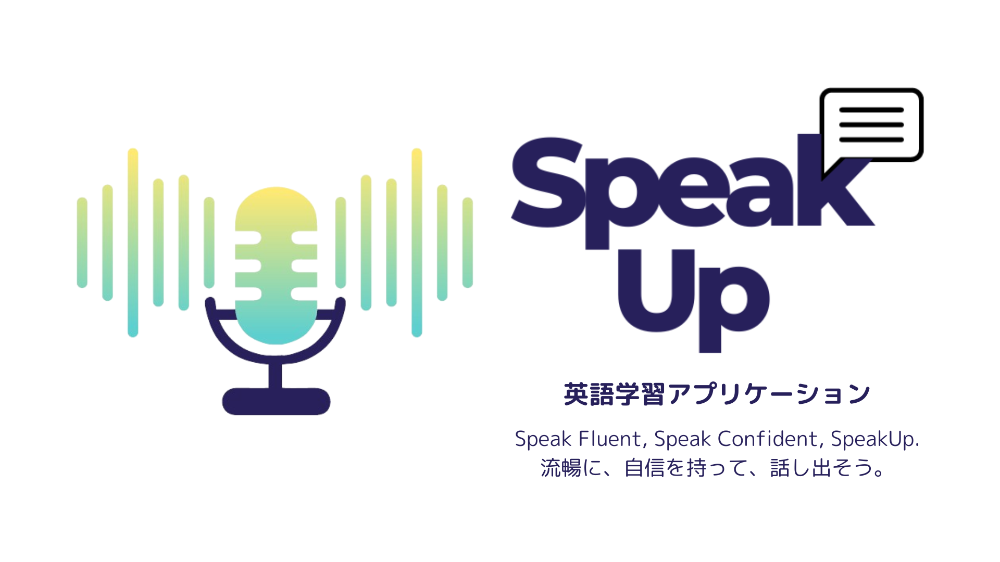
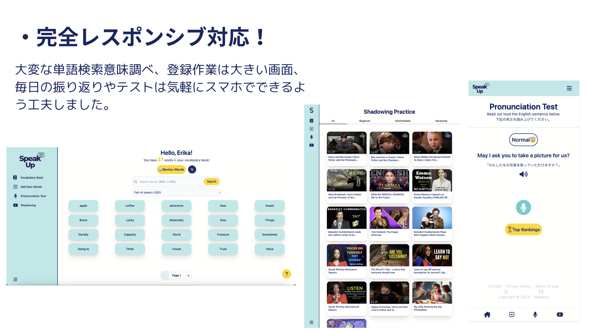
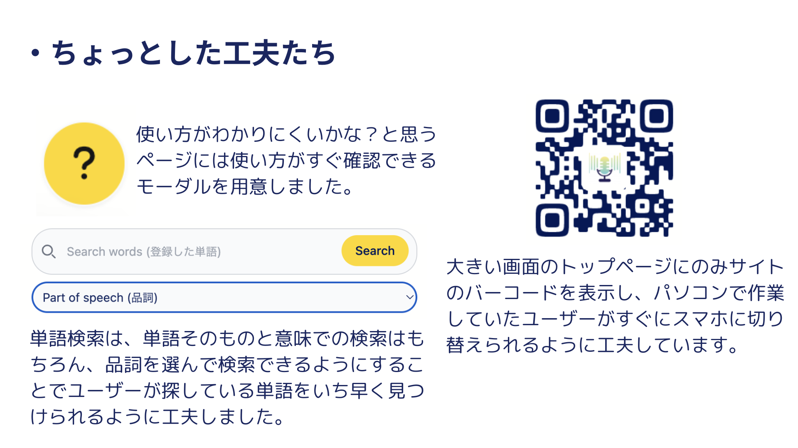

## サービス名
### [SpeakUp](https://speakup.fly.dev/)

## サービス概要
英語学習のためのアプリです。スピーキング力の向上に特化していて、シャドーイング、発音採点を通してスピーキング練習をしながら、単語登録機能によって新たな単語やフレーズを学ぶことができます。

## このサービスへの思い・作りたい理由
- スピーキング力向上へのハードルを下げたい
  一人での学習ではなかなかスピーキング力を向上することは難しいです。単語や文法など、教科書で勉強できることは沢山インプットしてきたけれど、話すとなると話せないという英語学習者を沢山みてきましたし、私自身もそうでした。一人でもアウトプットの練習ができるアプリを作りたいと思ったのがきっかけです。
- スピーキング力向上に効果的なシャドーイングができるアプリが少ないため
  動画の音声に合わせて同じスピードで同時に話す練習をすることをシャドーイングといいます。この学習方法はスピーキング力向上に効果的と言われていますが、まず動画のスクリプトを全てどこかに書き写してからしか学習が始められません。私自身、この書き写しが面倒で練習がなかなかできていないのでこの面倒なステップを取り除いて、すぐに練習できる環境を作りたいと思いました。
- 単純に英語が好き
  英語ができるようになって一番楽しい瞬間は、外国人とコミュニケーションが取れた時だと思います。話せるようになった楽しさをたくさんの英語学習者に味わってもらいたいです。

## ユーザー層について
- 英語のスピーキング力を向上させたいと思っている人
- 対人でのスピーキング練習は緊張するので一人で練習したいと思っている人
- ある程度のスピーキング力はあるが、会話のピッチや発音をネイティブにより近づけたいと思っている人

英語を本気で学習したいと思っている方々をターゲットとしております。

## サービスの利用イメージ
- シャドーイング練習
  あらかじめ用意された動画とスクリプトを使い、自分のやりたいようにシャドーイング練習をする。難易度別で分けられた動画一覧から選ぶことができる。
- 発音採点
  問題文をマイクに向かって読み、採点する。どの単語が発音できていなかったのかなどを知り分析できる。
- 単語保存
  シャドーイング、発音採点で学んだ単語を都度マイページに保存しておき、後で振り返ることができる。

## ユーザーの獲得について
会員登録不要でシャドーイングが体験できます。会員限定で視聴できる動画の種類を増やしたり、発音採点機能や単語保存機能を紹介し会員登録へ促します。

## サービスの差別化ポイント・推しポイント
英語学習系サービスは数多く存在しますが、シャドーイング学習が一つのサービスで完結しているものを見たことがないので、発音採点や単語登録機能だけのものと差別化できると考えています。

## 機能一覧
|機能紹介＆シャドーイングお試し機能|単語帳機能|
|:-------------|:-------------|
|||
|何ができるアプリなのか一目でイメージができます。|単語帳への単語登録、登録した単語確認、単語の発音確認ができます。|

|単語検索機能|単語復習機能|
|:-------------|:-------------|
|||
|品詞の種類やフリーワードで登録済みの単語を検索することができます。|登録済みの単語がランダムに出題されます。記憶の定着度に応じて復習頻度を設定できます。|

|発音採点機能|採点結果表示機能|
|:-------------|:-------------|
|||
|EasyとHardモード選択をして、見本音声を聞いてから発音採点に挑めます。|採点結果はバーチャートで表示されます。|

|発音採点結果ランキング機能|発音採点結果振り返り機能|
|:-------------|:-------------|
|||
|発音採点の平均点をレベルごとに週間ランキング化しています。ランクインしたらXシェアができます。|自分のスコアを英文ごとに振り返ることができます。|

|発音採点結果Xシェア機能|単語登録数Xシェア機能|
|:-------------|:-------------|
|||
|発音結果をXへシェアすることができます。|単語登録数をXへシェアすることができます。|

|シャドーイング動画一覧|シャドーイング練習機能|
|:-------------|:-------------|
|||
|レベル別に動画を探すことができます。練習中の動画をお気に入り登録することもできます。|シャドーイングのスクリプトと単語帳は連携しており、登録済みの単語を認識してその意味を表示します。声を録音して自分で振り返ることもできます。|

|自動翻訳機能|連続学習日数ランキング|
|:-------------|:-------------|
|||
|わからない単語を選択し、表示されたボタンをクリックするとAPIが自動的に日本語へ翻訳＆単語登録モーダルが開かれ、スムーズに単語帳へ登録できます。|学習を継続しているユーザーのアクティビティをランキングから確認できます。競争心を煽ることが目的です。|

### UI/UX
英語学習者は状況に合わせてPC、タブレット、スマホ全てを使い分けていることが多いです。
これら全ての機器で使いやすいUIを意識してナビゲーションバーを切り替えています。

## 主な使用技術
|カテゴリー|使用技術| 
|:--|:--|
|サーバーサイド|Ruby 3.2.2   Rails 7.1.3.3|
|データベース|PostgreSQL|
|認証|Devise|
|描画関係|HTML   TailwindCSS   daisyUI   JavaScript   React   HotWire|
|デプロイ|fly.io|
|開発環境|Docker|
|CI/CD|GitHub Actions|
|API|Azure Cognitive Services Speech SDK   Youtube IFrame Player API   Web Speech API   DeepL API|

## 画面遷移図
https://www.figma.com/design/utOZSCo8QNxPXmBKep3BeQ/SpeakUp-app?t=0oftbWXu2Fkoi5E3-1

## ER図

## Qiita
https://qiita.com/Erika328/items/0a181eb816e4237c05ab